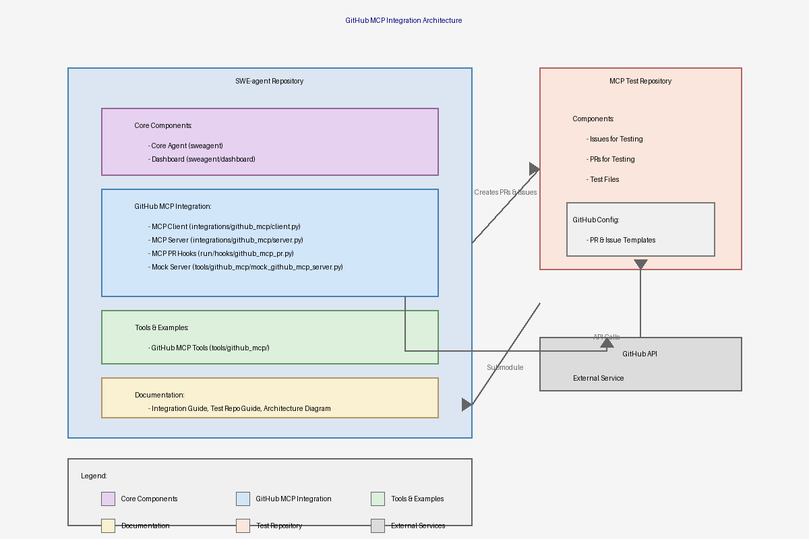

# GitHub MCP Integration Architecture

This document provides an overview of the architecture for the GitHub Model Context Protocol (MCP) integration in SWE-agent.

## Architecture Diagram

## Diagram Description

The architecture diagram illustrates the structure and relationships of the GitHub MCP integration:

### SWE-agent Repository Components

- **Core Components**:
  - Core Agent (sweagent)
  - Monitoring Dashboard (sweagent/dashboard)

- **GitHub MCP Integration**:
  - MCP Client: Handles API communication
  - MCP Server: Manages protocol integration
  - MCP PR Hooks: Integrates with run hooks
  - Mock MCP Server: Provides testing environment

- **Tools & Examples**:
  - MCP Tools: Utility scripts

- **Documentation**:
  - Integration Guide
  - Test Repository Guide
  - Architecture Diagram

### MCP Test Repository

- Test files for PR creation
- Issues for testing MCP integration
- Pull Requests created via MCP
- GitHub configuration templates

### External Components

- GitHub API

### Connections

The diagram shows the flow of data and interactions between components, including:
- Integration between SWE-agent and the MCP test repository (for creating PRs and issues)
- Communication channels to GitHub API
- Submodule relationship between repositories

## File Formats

The architecture diagram is available in the following formats:

- [PNG Format](images/architecture_diagram.png)
- [SVG Format](images/architecture_diagram.svg) (scalable vector graphic, higher quality)

## Source Files

The diagram source files are also available if you need to make modifications:

- [PNG Generation Script](images/create_diagram.py)
- [SVG Generation Script](images/create_svg_diagram.py)