# GitHub MCP Integration Architecture

This document contains the architecture diagram for the GitHub MCP integration in SWE-agent and its relationship with the mcp-test-repo.

## Architecture Diagram (Mermaid)

```mermaid
graph TD
    %% Main SWE-agent Components
    subgraph "SWE-agent Repository"
        CoreAgent["Core Agent\n(sweagent)"]
        Dashboard["Monitoring Dashboard\n(sweagent/dashboard)"]
        RunHooks["Run Hooks System\n(sweagent/run/hooks)"]
        
        %% GitHub MCP Integration Components
        subgraph "GitHub MCP Integration"
            MCPClient["MCP Client\n(sweagent/integrations/github_mcp/client.py)"]
            MCPServer["MCP Server\n(sweagent/integrations/github_mcp/server.py)"]
            MCPConfig["MCP Config\n(sweagent/integrations/github_mcp/config.py)"]
            MCPHooks["MCP PR Hooks\n(sweagent/run/hooks/github_mcp_pr.py)"]
            MockServer["Mock MCP Server\n(tools/github_mcp/mock_github_mcp_server.py)"]
        end
        
        %% Tools and Examples
        subgraph "Tools & Examples"
            Tools["MCP Tools\n(tools/github_mcp/)"]
            Examples["MCP Examples\n(examples/github_mcp/)"]
            Tests["MCP Tests\n(tests/github_mcp/)"]
        end
        
        %% Documentation
        subgraph "Documentation"
            IntGuide["Integration Guide\n(docs/github_mcp/integration_guide.md)"]
            TestRepoGuide["Test Repo Guide\n(docs/github_mcp/test_repo_guide.md)"]
            ArchDiagram["Architecture Diagram\n(docs/github_mcp/architecture_diagram.md)"]
        end
    end
    
    %% MCP Test Repository
    subgraph "MCP Test Repository"
        TestRepo["mcp-test-repo\n(GitHub Repository)"]
        Issues["Issues for Testing"]
        PRs["Pull Requests for Testing"]
        TestFiles["Test Files\n(test-file.md)"]
        
        subgraph "GitHub Config"
            PRTemplate["PR Template\n(.github/PULL_REQUEST_TEMPLATE.md)"]
            IssueTemplates["Issue Templates\n(.github/ISSUE_TEMPLATE/)"]
        end
    end
    
    %% External Components
    subgraph "External Components"
        GitHub["GitHub API"]
        DockerMCP["Official GitHub MCP Server\n(Docker Container)"]
    end
    
    %% Connections between components
    CoreAgent --> RunHooks
    CoreAgent --> Dashboard
    RunHooks --> MCPHooks
    
    MCPHooks --> MCPClient
    MCPClient --> MCPConfig
    MCPClient --> GitHub
    MCPClient --> DockerMCP
    MCPClient --> MockServer
    
    Tools --> MockServer
    Examples --> MockServer
    Tests --> MockServer
    
    MockServer --> GitHub
    DockerMCP --> GitHub
    
    GitHub --> TestRepo
    GitHub --> Issues
    GitHub --> PRs
    
    IntGuide --> TestRepoGuide
    TestRepoGuide --> TestRepo
    
    %% Submodule relationship
    TestRepo -.->|"Submodule"| CoreAgent
    
    %% Add styling
    classDef core fill:#f9f,stroke:#333,stroke-width:2px;
    classDef mcp fill:#bbf,stroke:#33f,stroke-width:1px;
    classDef tools fill:#dfd,stroke:#3a3,stroke-width:1px;
    classDef docs fill:#ffd,stroke:#aa3,stroke-width:1px;
    classDef test fill:#fcc,stroke:#c33,stroke-width:1px;
    classDef external fill:#eee,stroke:#999,stroke-width:1px;
    
    class CoreAgent,Dashboard,RunHooks core;
    class MCPClient,MCPServer,MCPConfig,MCPHooks,MockServer mcp;
    class Tools,Examples,Tests tools;
    class IntGuide,TestRepoGuide,ArchDiagram docs;
    class TestRepo,Issues,PRs,TestFiles,PRTemplate,IssueTemplates test;
    class GitHub,DockerMCP external;
```



## Rendering the Diagram

To render this diagram as SVG or PNG:

1. **Option 1: Use Mermaid Live Editor**
   - Go to [Mermaid Live Editor](https://mermaid.live/)
   - Copy the Mermaid code above (between the triple backticks)
   - Paste it into the editor
   - Download as SVG or PNG

2. **Option 2: Use GitHub Markdown**
   - GitHub automatically renders Mermaid diagrams in markdown files
   - Commit this file to your repository
   - View it on GitHub to see the rendered diagram

3. **Option 3: Command Line with npm**
   ```bash
   # Install mermaid-cli
   npm install -g @mermaid-js/mermaid-cli
   
   # Extract the Mermaid code to a file
   sed -n '/```mermaid/,/```/p' architecture_diagram.md | sed '1d;$d' > diagram.mmd
   
   # Generate SVG
   mmdc -i diagram.mmd -o architecture_diagram.svg
   
   # Generate PNG
   mmdc -i diagram.mmd -o architecture_diagram.png
   ```

## Diagram Description

This architecture diagram illustrates:

1. **SWE-agent Repository Structure**:
   - Core components including the agent, dashboard, and run hooks
   - Complete GitHub MCP integration components
   - Documentation, tools, and examples

2. **MCP Test Repository**:
   - Structure and purpose
   - Relationship to the main repository (as a submodule)
   - GitHub configuration for testing

3. **External Components**:
   - GitHub API integration
   - Official GitHub MCP Server Docker container

4. **Connections**:
   - How components interact with each other
   - Data flow for PR and issue creation
   - Documentation references

The diagram uses color coding to distinguish different component types:
- Purple: Core SWE-agent components
- Blue: GitHub MCP integration components
- Green: Tools and examples
- Yellow: Documentation
- Red: Test repository components
- Gray: External services